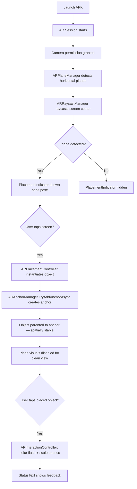

# AR Feasibility Prototype — P1 Implementation Plan

Build the smallest working AR prototype: detect planes → show indicator → tap to place object → anchor it → tap to interact → works offline.

## User Review Required

> [!IMPORTANT]
> **Unity project creation must be done manually.** Unity projects cannot be created from the CLI — you need to create the project in Unity Hub first (or we can scaffold the file structure manually). Since your `mobile/UnityProject/` directory is empty, this plan **scaffolds all project files from scratch** so Unity can import them. However, you will still need to:
> 1. Open the project in Unity 6.3 LTS via Unity Hub
> 2. Let Unity resolve packages and compile
> 3. Open the scene and verify the hierarchy
> 4. Build the APK via **File → Build Settings → Build**

> [!WARNING]
> **Graphics API:** ARCore does **not** support Vulkan. The ProjectSettings must force OpenGLES3 only. This is handled in the plan below.

## Open Questions

1. **Package version**: Research shows AR Foundation `6.1.x` is the latest stable for Unity 6.x LTS. I'll use `6.1.1` — if your Unity Hub shows a different verified version, let me know.
2. **Company name / bundle ID**: I'll use `com.sih2026.arvocational` — change if needed.
3. **URP vs Built-in**: Using **Built-in Render Pipeline** (3D Core) to keep things minimal. AR Foundation works with both. Confirm if you prefer URP.

## Proposed Changes

### Overview — File Tree

```
mobile/UnityProject/
├── Assets/
│   ├── Scenes/
│   │   └── ARPrototype.unity           ← main scene (YAML)
│   ├── Scripts/
│   │   ├── ARPlacementController.cs    ← raycast + place + anchor
│   │   ├── ARInteractionController.cs  ← tap-on-object feedback
│   │   └── PlacementIndicator.cs       ← reticle visual at raycast point
│   ├── Prefabs/
│   │   ├── PlacementReticle.prefab     ← ring indicator prefab
│   │   └── PlaceableObject.prefab      ← simple cube with material
│   └── Materials/
│       ├── ReticleMaterial.mat         ← semi-transparent ring
│       ├── ObjectMaterial.mat          ← object color
│       └── FeedbackMaterial.mat        ← highlight on tap
├── Packages/
│   └── manifest.json                   ← AR Foundation + ARCore packages
├── ProjectSettings/
│   ├── ProjectSettings.asset           ← player settings, graphics API
│   ├── QualitySettings.asset
│   ├── EditorBuildSettings.asset       ← scene list
│   ├── XRPluginManagement/             ← ARCore enabled
│   └── ...
└── UserSettings/                       ← (gitignored, auto-generated)
```

---

### 1. Package Configuration

#### [NEW] [manifest.json](file:///d:/Codes/26041-AR-vocational-safety/mobile/UnityProject/Packages/manifest.json)

Packages to install:
| Package | Version | Purpose |
|---|---|---|
| `com.unity.xr.arfoundation` | `6.1.1` | AR Foundation core |
| `com.unity.xr.arcore` | `6.1.1` | ARCore provider for Android |
| `com.unity.xr.management` | `4.5.0` | XR Plug-in Management |
| `com.unity.inputsystem` | `1.11.2` | Required by AR Foundation 6.x (`TrackedPoseDriver`) |

No ARKit (iOS not targeted). No XR Interaction Toolkit (unnecessary for P1).

---

### 2. Project Settings

#### [NEW] [ProjectSettings.asset](file:///d:/Codes/26041-AR-vocational-safety/mobile/UnityProject/ProjectSettings/ProjectSettings.asset)

Key Android settings:
- **Minimum API Level**: Android 7.0 (API 24) — ARCore minimum
- **Target API Level**: Android 14 (API 34)
- **Scripting Backend**: IL2CPP
- **Target Architectures**: ARM64 only
- **Graphics APIs**: OpenGLES3 only (Vulkan removed — ARCore incompatible)
- **Multithreaded Rendering**: Disabled
- **Package Name**: `com.sih2026.arvocational`
- **Camera Usage Description**: set for permission prompt
- **Internet Access**: Not required (offline-capable)

#### [NEW] XR Plug-in Management settings
- Android tab → ARCore **enabled**
- Standalone tab → nothing (Editor testing via XR Simulation if needed)

---

### 3. Scene Hierarchy

#### [NEW] [ARPrototype.unity](file:///d:/Codes/26041-AR-vocational-safety/mobile/UnityProject/Assets/Scenes/ARPrototype.unity)

```
ARPrototype (Scene)
├── AR Session                          ← ARSession component
├── XR Origin                           ← XROrigin component
│   ├── Camera Offset
│   │   └── Main Camera                ← Camera + TrackedPoseDriver
│   ├── ARPlaneManager                  ← (component on XR Origin)
│   ├── ARRaycastManager                ← (component on XR Origin)
│   └── ARAnchorManager                 ← (component on XR Origin)
├── ARPlacementController               ← script: placement logic
├── PlacementIndicator                  ← script + reticle mesh (initially disabled)
├── Directional Light
└── UI Canvas
    └── StatusText (TextMeshPro)        ← simple status feedback
```

**Components on XR Origin GameObject:**
- `XROrigin`
- `ARPlaneManager` (detection mode: Horizontal)
- `ARRaycastManager`
- `ARAnchorManager`

---

### 4. Scripts

#### [NEW] [ARPlacementController.cs](file:///d:/Codes/26041-AR-vocational-safety/mobile/UnityProject/Assets/Scripts/ARPlacementController.cs)

**Responsibilities:**
- Every frame: raycast from screen center → detected planes
- If hit: update `PlacementIndicator` position/rotation, show it
- On tap (if indicator visible & no object placed): instantiate `PlaceableObject` prefab at hit pose
- Attach object to an `ARAnchor` via `ARAnchorManager.TryAddAnchorAsync()`
- After placement: disable plane visualization (cleaner view)

**Key API calls:**
```csharp
ARRaycastManager.Raycast(screenCenter, hits, TrackableType.PlaneWithinPolygon)
ARAnchorManager.TryAddAnchorAsync(hitPose)  // Unity 6 async API
```

#### [NEW] [ARInteractionController.cs](file:///d:/Codes/26041-AR-vocational-safety/mobile/UnityProject/Assets/Scripts/ARInteractionController.cs)

**Responsibilities:**
- On tap: Physics.Raycast from camera through touch point
- If hits placed object: trigger feedback (color flash + scale bounce + status text)
- Uses `Camera.ScreenPointToRay()` for world-space raycast
- Cooldown to prevent spam taps

#### [NEW] [PlacementIndicator.cs](file:///d:/Codes/26041-AR-vocational-safety/mobile/UnityProject/Assets/Scripts/PlacementIndicator.cs)

**Responsibilities:**
- Manages the visual reticle (a flat ring/disc)
- `UpdatePlacement(Pose)` — move + rotate to match detected plane
- `Show()` / `Hide()` — visibility control
- Gentle pulsing animation for visual feedback

---

### 5. Prefabs & Materials

#### PlacementReticle
- A flat **Cylinder** (scale 0.1, 0.001, 0.1) with transparent ring material
- Semi-transparent green color
- Subtle pulse animation via script

#### PlaceableObject
- A **Cube** (scale 0.15 × 0.15 × 0.15 — ~15cm)
- Orange material with slight metallic sheen
- Has a `BoxCollider` for tap interaction raycasts
- Tag: `PlaceableObject`

---

### 6. Offline Capability

- **No network calls** anywhere in code
- `internetAccess` set to `NotRequired` in PlayerSettings
- No analytics, no remote config, no asset bundles
- ARCore itself works fully offline once installed on device

---

## Architecture Diagram



---

## Verification Plan

### Build Verification
1. Open project in Unity 6.3 LTS
2. Verify no console errors after package resolution
3. **File → Build Settings → Android → Switch Platform**
4. Add `ARPrototype` scene to build
5. **Build** (not Build and Run) to produce APK
6. Confirm APK generates without errors

### Device Testing (iQOO Neo6 — ADB ID: I2202)
```bash
# Install APK
adb -s I2202 install -r path/to/build.apk

# Launch
adb -s I2202 shell am start -n com.sih2026.arvocational/com.unity3d.player.UnityPlayerActivity

# Verify acceptance flow:
# 1. Camera permission prompt appears → grant
# 2. Point at flat surface (table/floor) → white plane meshes appear
# 3. Green reticle tracks center of detected plane
# 4. Tap screen → orange cube appears at reticle position
# 5. Walk around → cube stays anchored in place
# 6. Tap the cube → color flashes, scale bounces, status text updates
# 7. Disable WiFi + mobile data → app continues working

# Check logs
adb -s I2202 logcat -s Unity:V
```

### Manual Verification
- [ ] APK builds without errors
- [ ] Camera permission requested on launch
- [ ] Horizontal planes detected within ~5 seconds on flat surface
- [ ] Placement reticle visible and tracking
- [ ] Tap places object at correct location
- [ ] Object remains stable when walking around (anchor working)
- [ ] Tap on object triggers visual feedback
- [ ] App works with all network disabled

---

## Potential Blockers for Next Phase

| Risk | Mitigation |
|---|---|
| iQOO Neo6 must have "Google Play Services for AR" installed | Pre-check: `adb shell pm list packages \| findstr arcore` |
| Unity 6.3 LTS may ship different AR Foundation version than 6.1.1 | Use Package Manager to verify; adjust manifest.json if needed |
| IL2CPP requires Android NDK — Unity Hub should have installed it | Check **Edit → Preferences → External Tools → NDK** |
| First build may be slow (IL2CPP compilation) | Expected ~5-10 min first build |

---

## Execution Approach

Since Unity projects require the Editor for scene serialization and building, I will:

1. **Create all script files** (`.cs`) — these are plain text and fully automatable
2. **Create `manifest.json`** — package declarations
3. **Create key ProjectSettings files** — as much as possible via text
4. **Provide exact Unity Editor steps** — for scene setup, component wiring, and building

> [!IMPORTANT]
> Unity scene files (`.unity`) and prefab files (`.prefab`) are complex YAML that references GUIDs generated at import time. Creating them from scratch outside Unity is fragile. The recommended approach is: I create all scripts + settings, you open in Unity, and I provide step-by-step instructions to wire the scene hierarchy.
